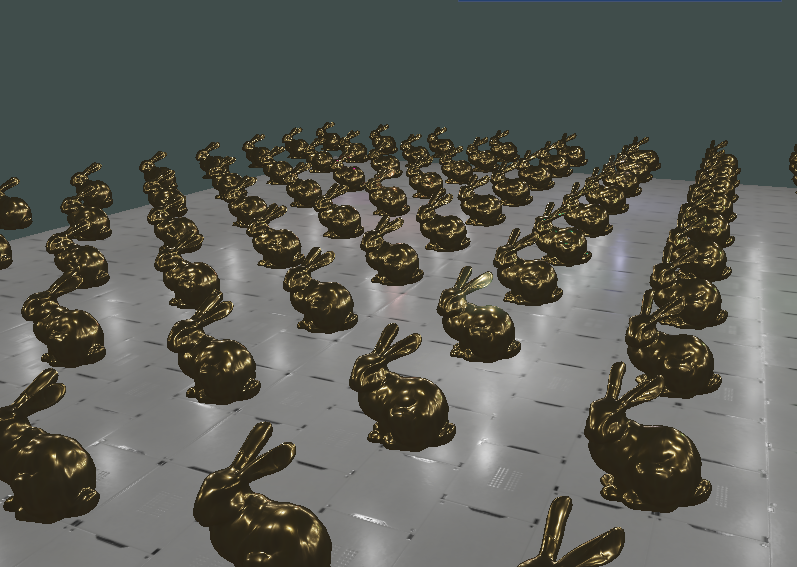

# GlowRenderer

A high-performance deferred rendering engine implementing physically-based rendering (PBR), frustum culling, and instanced rendering. Supports hundreds of dynamic light sources with real-time performance.




## Architecture

The renderer employs a **deferred rendering pipeline** that separates geometry and lighting into distinct passes. The first pass renders scene geometry to a G-buffer containing position, normal, albedo, metallic, roughness, and ambient occlusion data. The second pass performs lighting calculations using this G-buffer data, enabling efficient rendering with multiple light sources.

**PBR materials** implement physically-based rendering using the metallic-roughness workflow. Each material includes albedo, normal, metallic, roughness, and ambient occlusion maps, providing realistic surface properties and lighting responses.

The **lighting system** supports multiple light types including point, directional, and spot lights, each with configurable attenuation parameters. The deferred approach allows unlimited light sources without performance degradation.

**Core components** include a first-person camera with mouse look and WASD movement, a mesh system built on VAO/VBO/EBO abstraction with OBJ loading support, comprehensive shader management for GLSL compilation and uniform handling, a texture system for OpenGL texture loading and binding, and a lighting engine that provides real-time updates for all light sources.

## Performance Features

The renderer implements several key optimizations to maintain real-time performance with complex scenes. **Frustum culling** eliminates off-screen objects by calculating bounding boxes for mesh instances and performing view frustum intersection tests. This includes a configurable toggle for performance analysis and real-time culling statistics display.

**Deferred rendering** provides efficient lighting by using a single geometry pass to populate a G-buffer containing position, normal, albedo, metallic, roughness, and ambient occlusion data. Lighting calculations are then performed in screen space, eliminating overdraw from multiple light sources and supporting unlimited light sources without performance degradation.

**Instanced rendering** efficiently handles multiple mesh instances through single draw calls. The current scene renders 100+ bunny instances by storing transform matrices in GPU memory, reducing CPU-GPU communication overhead and enabling batch processing for similar geometry.

**Texture optimization** includes PBR texture compression, mipmapping, and texture atlasing to reduce state changes. The system implements efficient texture binding/unbinding and memory-aware texture management.

**Shader optimization** features pre-compiled shader programs and uniform buffer objects for light data. Matrix transformations leverage GLM for efficiency, while minimizing shader state changes between draws.

**Memory management** utilizes VAO/VBO/EBO abstraction for efficient GPU memory usage, with vertex data interleaving for cache-friendly access. The system includes automatic cleanup, resource management, and memory pooling for frequently allocated objects.

## Dependencies

- **OpenGL 4.0+** with GLAD loader
- **SDL2** for window management and input
- **GLM** for mathematics (vectors, matrices, transformations)
- **Dear ImGui** for debug UI and controls
- **STB Image** for texture loading

## Build Requirements

- CMake 3.10+
- C++20 compiler
- SDL2 development libraries
- OpenGL development headers

## Building

```bash
mkdir build && cd build
cmake ..
make
```

## Controls

- **WASD**: Camera movement
- **Mouse**: Camera rotation
- **Tab**: Toggle camera mode
- **F**: Toggle frustum culling
- **ImGui**: Real-time parameter adjustment

## Shader Pipeline

1. **G-Buffer Pass**: Renders geometry data to multiple render targets
2. **Lighting Pass**: Calculates final lighting using G-buffer data
3. **Post-Processing**: Optional effects and final composition

## File Structure

```
src/
├── core/           # Camera and core systems
├── rendering/      # Rendering pipeline and mesh management
├── lighting/       # Light source implementations
└── utils/          # Frustum culling and optimization
```
